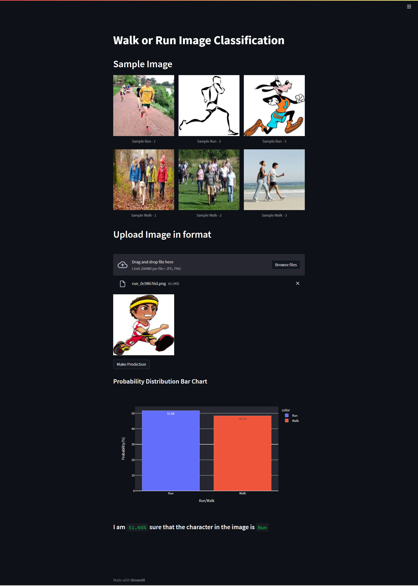

# Walk-or-Run Image Classification

 

## Data

#### Data for this project is taken from Kaggle. It contains 500+ images for training and 100+ images for testing. This image data needs to be processed and then used to build a CNN to classifiy images. Find the data on kaggle [here](https://www.kaggle.com/datasets/huan9huan/walk-or-run).

## Files

#### The code is written in python using google colab. Find all the for the project [here](https://drive.google.com/drive/folders/1NEBoKMyIoYkpaaD4pTOvODC2_wa9Q8mA?usp=sharing).

## Analysis

#### The analysis i.e. processing of image data and model building is done using tensorflow and keras. Here I have used InceptionV3 model which is an inbuilt model in keras. InceptionV3 model gave highest 97% accuracy.

## End-to-End

#### The webapp to test the CNN in action to classify running and walking images is built using streamlit. You can read about streamlit [here](https://docs.streamlit.io/). Below is the image of the webapp desing.

